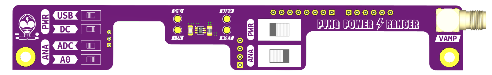

# PCB Design for Pynq Power Ranger

    

## 🚀 Description

This folder contains all the necessary files to manufacture the Pynq Power Ranger board. The design has been created using [KiCad EDA](https://kicad.org/).

## 📁 Repository Contents

- **KiCad Project Files**: The complete KiCad project files for the Pynq Power Ranger board.
- **Gerber Files**: The Gerber files required for PCB manufacturing.
- **BOM (Bill of Materials)**: A comprehensive list of all components used in the design.
- **Schematic Diagrams**: The schematic diagrams of the Pynq Power Ranger board.
- **PCB Layout**: The PCB layout files showing the physical arrangement of components and traces.

## 🔧 Design Overview

The board implements the following functionalities:
- A **shunt resistor** for current sensing.
- A **precision transimpedance amplifier** (INA214) to amplify the voltage drop across the shunt resistor.
- An ADC input connected to the FPGA's **XADC module** for voltage measurement.
- A **selectable input range** using a switch to choose between two different ADC input pins (VP and Arduino A0).
- A **power supply selection** switch to choose between USB and DC jack input for the Pynq-Z2 board.
- An **SMA connector** for direct voltage measurement with an oscilloscope.

### Input Range and Resolution
- **Arduino-compatible pins**: Internally connected to a resistor voltage divider that outputs **1.0 V when the input voltage is 3.3 V**. This allows for a wider input range at the cost of resolution.
- **VP pin**: Directly connected to the ADC input, providing better resolution but a lower range.

The amplifier has a **gain of 100 V/V**, and the **shunt resistor is 8 mΩ**. Thus, the INA214 output voltage is:

$$ V_{INA} = (I_{LOAD} \times 0.008 \ \Omega) \times 100 \text{ V/V} $$

- **For the VP pin ($V_{VP} = V_{INA}$)**, saturation occurs at $I_{LOAD}$ = 1.25 A ($V_{INA} = V_{ADC \ REF}$ = 1.0 V).

>[!CAUTION] If higher currents are required (e.g., for powering external PMODs), switch to **A0 mode**.

The output of the transimpedance amplifier is also routed to the SMA connector on the right side of the board, enabling a direct connection to an oscilloscope with high input impedance.
