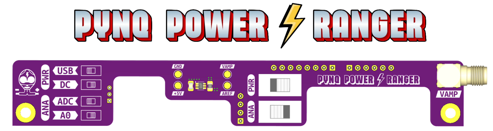

    

## 🚀 Overview

The **Pynq Power Ranger** is a shield designed for the Xilinx Pynq-Z2 SoC board, enabling real-time power consumption measurement of the entire board. The repository contains the necessary PCB files to manufacture the power measurement shield together with the IP configuration to control the current measurement from Linux running on the processing system. The shield measures the voltage drop across a shunt resistor placed in series with the Pynq-Z2 power supply line using the ADC of the FPGA chip.

## 📦 Repository Contents
- **[Software Support](SW_Examples/README.md)**: The IP and driver to measure the current from the processing system and one application example that uses the Pynq Power Ranger to compute the energy consumption.
- **[Schematics & PCB](PCB_Design/README.md)**: A description of the board design and the KiCad files for board design, production, and hand/PnP assembly.

## ⚙️ Features

### ⚡ Selectable Input Power Supply
The switch **SW1 (PWR)** selects the power source of the Pynq-Z2 board:
- **Left**: The USB Micro-B Connector (5.0 V)
- **Right**: The DC Jack (7.0 V - 15.0 V, post-regulated to 5.0 V)

> [!WARNING]
> This switch replaces the jumper of the board. If the correct source is not selected, the board will not power up.

### 🎯 Selectable ADC Input Range and Precision
Use **SW2 (ANA)** to toggle between the inputs:
- **Left**: Specialized pin of the XADC of the chip (VP) -> Used by the Software Support examples
- **Right**: An alternative Arduino A0 pin. Internally connected to a 3:1 resistor voltage divider that outputs (1.0 V when the input voltage is 3.3 V). This allows for a wider input range at the cost of resolution.

| Input Pin | Saturation Point | Resolution |
|-----------|------------------|------------|
| VP        | 1.25 A           | 0.3 mA     |
| A0        | 3.75 A           | 1.0 mA     |

> [!WARNING]
> The onboard ADC of the Pynq-Z2 board has a reference voltage of 1.0 V, which defines the saturation point of the measurement. If the current exceeds this value, the measurement will saturate and will not be accurate.

### 🧵 Thread-based Measurements
The software examples provided in this repository use a thread-based approach to continuously monitor the current consumption to accurately estimate energy consumption. This allows for real-time data acquisition and processing without blocking the main application.

## Contact
For additional information, please contact the authors:
- **Alex López**: [alejandro.lopezrodriguez@epfl.ch](mailto:alejandro.lopezrodriguez@epfl.ch)
- **Rubén Rodríguez**: [ruben.rodriguezalvarez@epfl.ch](mailto:ruben.rodriguezalvarez@epfl.ch)
- **Miguel Peón**: [miguel.peon@epfl.ch](mailto:miguel.peon@epfl.ch)

Developed at the **[Embedded Systems Laboratory (ESL), EPFL](https://www.epfl.ch/labs/esl/research/)**.
