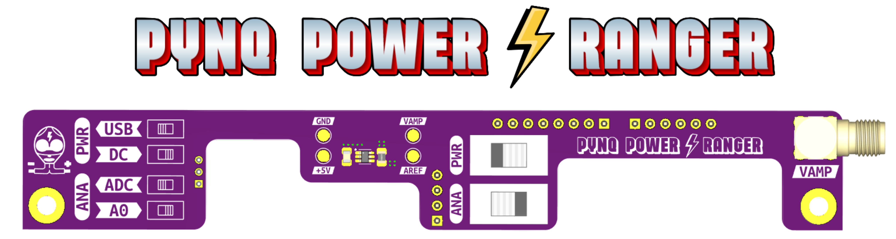

    

## 🚀 Overview

The **Pynq Power Ranger** is a shield designed for the Xilinx Pynq-Z2 SoC board, enabling real-time power consumption measurement. This is achieved using the ADC integrated into the SoC in combination with a shunt-based precision transimpedance amplifier (INA214).

## ⚙️ Features

### ⚡ Selectable Input Power Supply
The Pynq-Z2 board can be powered via:
- **USB Micro-B Connector** (5.0 V)
- **DC Jack** (7.0 V - 15.0 V, post-regulated to 5.0 V)

> [!NOTE]
> Use **SW1 (PWR)**  to select the appropriate power source:
> - **Left**: USB
> - **Right**: DC Jack

> [!WARNING]  
> If the correct source is not selected, the board will not power up.

### 🎯 Selectable ADC Input Range and Precision
The onboard ADC of the Pynq-Z2 board has a **reference voltage of 1.0 V**. Signals can be digitized through:
- **Arduino-compatible pins (A0-A5)**
- **VP pin** (located on the vertical female connector adjacent to the buttons)

#### Input Range and Resolution
- **Arduino-compatible pins**: Internally connected to a resistor voltage divider that outputs **1.0 V when the input voltage is 3.3 V**. This allows for a wider input range at the cost of resolution.
- **VP pin**: Directly connected to the ADC input, providing better resolution but a lower range.

> [!NOTE]
> Use **SW2 (ANA)** to toggle between the inputs:
> - **Left**: VP
> - **Right**: Arduino A0 pin

The amplifier has a **gain of 100 V/V**, and the **shunt resistor is 8 mΩ**. Thus, the INA214 output voltage is:

$$ V_{INA} = (I_{LOAD} \times 0.008 \ \Omega) \times 100 \text{ V/V} $$

- **For the VP pin ($V_{VP} = V_{INA}$)**, saturation occurs at $I_{LOAD}$ = 1.25 A ($V_{INA} = V_{ADC \ REF}$ = 1.0 V).

>[!CAUTION]
> If higher currents are required (e.g., for powering external PMODs), switch to **A0 mode**.

The output of the transimpedance amplifier is also routed to the SMA connector on the right side of the board, enabling a direct connection to an oscilloscope with high input impedance.

#### Resolution:
- **VP Pin**: 0.3 mA
- **A0 Pin**: 1.0 mA

## Repository Contents
- **Software Support**: Two examples demonstrating how to interface with the Pynq Power Ranger using Vitis HLS and Vivado 2022.2.
- **Schematics & PCB**: KiCad files for board design, production, and hand/PnP assembly.

## Contact
For additional information, please contact the authors:
- **Alex López**: [alejandro.lopezrodriguez@epfl.ch](mailto:alejandro.lopezrodriguez@epfl.ch)
- **Rubén Rodríguez**: [ruben.rodriguezalvarez@epfl.ch](mailto:ruben.rodriguezalvarez@epfl.ch)
- **Miguel Peón**: [miguel.peon@epfl.ch](mailto:miguel.peon@epfl.ch)

Developed at the **Embedded Systems Laboratory (ESL), EPFL**.

